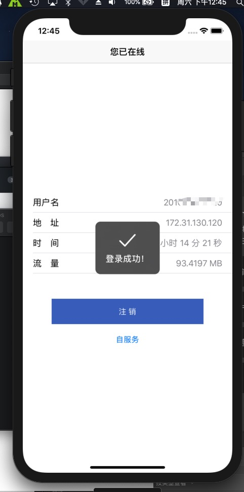

# E-HAUT
An iOS App for Srun3k Client for HAUT 

河南工业大学校园网客户端 iOS 版

适配 ** iOS9** 及以上系统



### 开发指南

```
sudo gem install cocoapods
git clone https://github.com/ehaut/E-HAUT.git
cd E-HAUT
pod install
```
然后请使用 xcode 打开 `E-HAUT.xcworkspace`

 ### LICENSE
 
 [GPL V3 License](LICENSE)

 
 ### Contributing
 
 PR are welcome.
